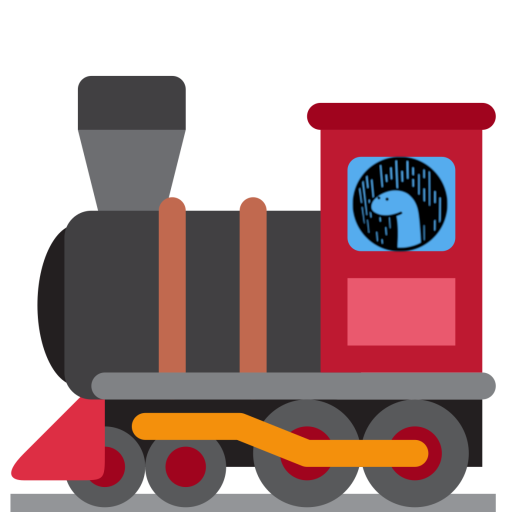

# Node Express way for Deno

This Project is inspired by https://github.com/jinjor/deno-playground/tree/master/expressive it shows a solution to run a Deno Webserver like the node express way

<div align="center">
     
</div>

## Example 

server.ts File
```typescript
import * as expressive from "https://raw.githubusercontent.com/NMathar/deno-express/master/mod.ts";

(async () => {
  const port = 3000;
  const app = new expressive.App();
  app.use(expressive.simpleLog());
  app.use(expressive.static_("./public"));
  app.use(expressive.bodyParser.json());
  app.get("/api/todos", async (req, res) => {
    await res.json([{ name: "Buy some milk" }]);
  });
  // route with dynamic parameter
  app.get("/api/user/{user_id}", async (req, res) => {
    await res.json([{ id: req.params.user_id, name: "Jim Doe", phone: "12425323" }]);
  });
  const server = await app.listen(port);
  console.log("app listening on port " + server.port);
})();
```

### Start app
`deno run --allow-net --allow-read server.ts`
